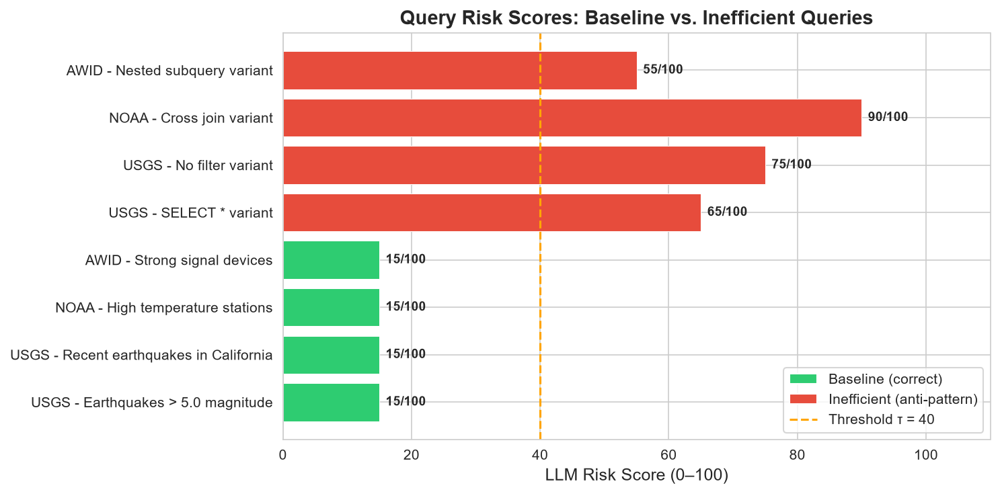
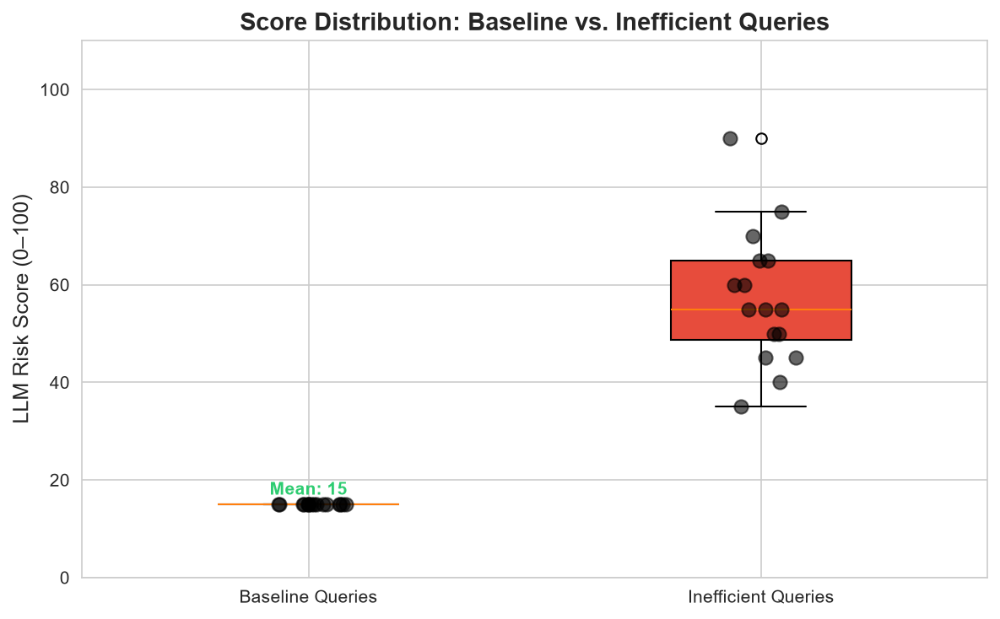
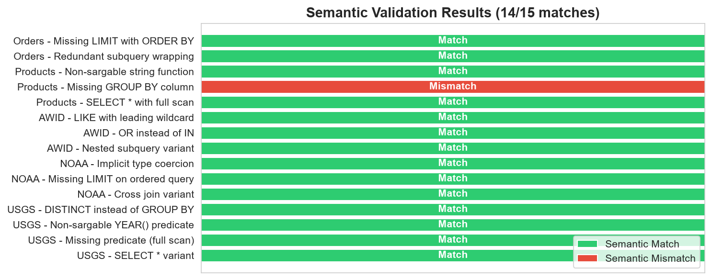
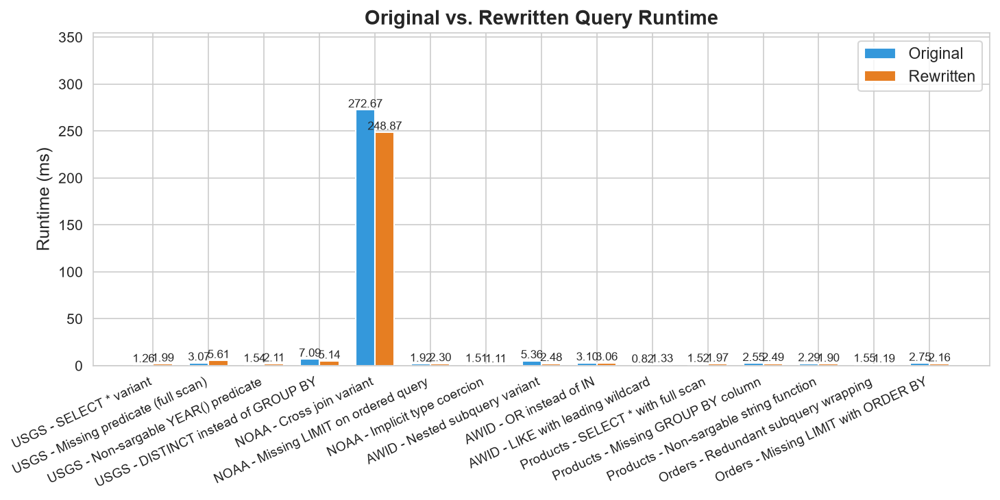
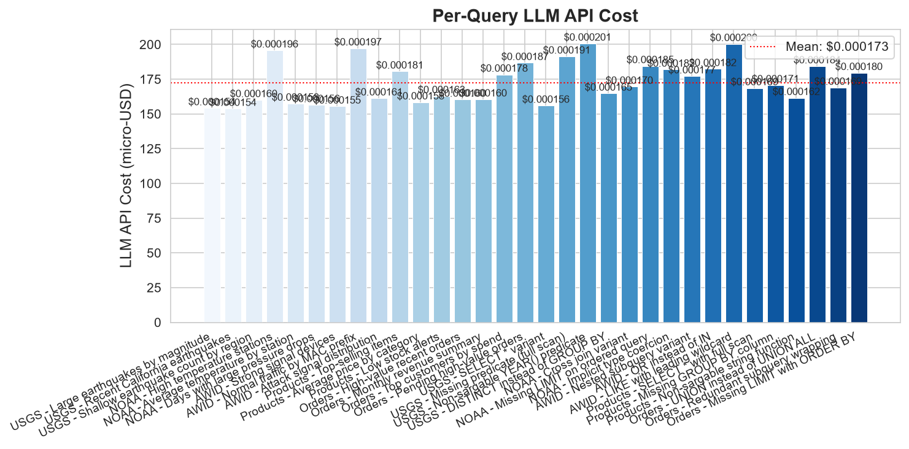

# LLM-Powered Query Monitoring and Optimization Using Reproducible External Data Workloads

**Author:** Shouvik Sharma (shouvik.s@somaiya.edu)

## Abstract

Manual SQL review does not scale in modern data warehouses. We present an LLM-powered query monitoring framework that identifies inefficient or risky SQL queries, recommends optimized rewrites, and validates recommendations through automated correctness checks. The system ingests public datasets, executes a controlled query workload against DuckDB, stores execution metadata in a SQLite query history database, analyzes queries with an LLM, and validates rewrites through semantic comparison. In our evaluation across five logical datasets and 32 queries (16 baseline and 16 intentionally inefficient variants), the framework achieved **96.9% detection accuracy**, **0.0% false positive rate**, **93.8% recall**, a **93.3% tested-instance result-equivalence rate** across flagged rewrites, and a total LLM API cost of **$0.005522**. The evaluation used 500-row in-memory DuckDB tables and should be interpreted as a reproducible query-governance artifact, not as a production-scale performance benchmark.

## Introduction

Data warehouses routinely process large volumes of analytical SQL, yet inefficient query patterns are often discovered only after they cause slow runtimes, unnecessary scans, or high cloud costs. Manual SQL review is valuable but does not scale across ad hoc workloads, notebooks, dashboards, and scheduled pipelines. This paper presents an **open-source, reproducible framework** for evaluating whether large language models can serve as a lightweight query-monitoring guardrail.

The framework is implemented as a public artifact at `https://github.com/shouvik-sharma/query-monitoring-framework`. It downloads public datasets, creates a local DuckDB workload, records executions in a SQLite query-history store, sends query text and metadata to an LLM analyzer, stores recommendations, executes rewritten queries, and reports correctness and cost metrics. The goal is practical reproducibility: a reader should be able to clone the repository, run the scripts, and inspect the same schema, workloads, and analysis reports.

## Related Work

### 2.1 SQL Anti-pattern Detection and Static Analysis

A mature ecosystem of static analysis tools exists for identifying risky SQL patterns. Tools such as `querylens` [1] and `sqlaudit` [2] provide deterministic rule-based checks for anti-patterns including `SELECT *`, cross joins, missing `WHERE` clauses, and SQL injection vectors. The Google BigQuery Anti-pattern Recognition tool [3] extends this approach to cloud warehouses, scanning `INFORMATION_SCHEMA` for top-slot-consuming jobs and flagging patterns such as missing partition filters, `ORDER BY` without `LIMIT`, and suboptimal join order. DWH-Auditor [4] similarly analyzes BigQuery metadata to detect full table scans and zombie tables. These tools are fast, deterministic, and suitable for CI/CD integration, but they operate on fixed rule sets and cannot adapt to novel or context-dependent inefficiencies that require semantic understanding. They also lack execution-based validation: a static pattern match may flag a query that is actually optimal for its specific schema and data distribution.

### 2.2 LLMs for SQL Optimization and Rewriting

Recent work has demonstrated that LLMs can go beyond static rules to understand SQL semantics and suggest optimizations. R-Bot [5] proposes a multi-source rewrite evidence pipeline with hybrid structure-semantics retrieval, achieving state-of-the-art rewrite quality on real-world datasets and benchmarks at Huawei. LLMOpt [6] uses fine-tuned LLMs for plan candidate generation and list-wise selection, outperforming traditional optimizers on the Join Order Benchmark (JOB). LLMSTEER [7] shows that LLM embeddings of raw SQL text contain sufficient semantic information for a simple binary classifier to outperform heuristic query optimizers on plan selection. LaPuda [8] introduces a policy-based multi-modal query optimizer guided by a cost descent algorithm that prevents the LLM from generating invalid plans. LLM4Hint [9] leverages moderate-sized LLMs to recommend query optimization hints for recurring queries. These approaches focus primarily on optimizer hint selection or plan generation rather than end-to-end monitoring, detection, and validated rewrite execution. Critically, most lack an automated validation loop that executes rewritten queries and verifies semantic equivalence against the original.

### 2.3 Cloud Warehouse Monitoring and Workload Governance

Production cloud data warehouses have motivated significant work on workload monitoring and cost governance. SnowPatrol [10] applies anomaly detection and machine learning to Snowflake usage data, flagging unusual consumption patterns. Keebo [11] continuously monitors warehouse performance telemetry to automate warehouse sizing, clustering, and auto-suspend intervals, reducing customer costs. Bress et al. [12] analyzed 667 million production queries from Snowflake, providing a detailed characterization of real-world analytical workloads and identifying gaps in standard benchmarks such as TPC-DS. Patterns [13] extracts query history from BigQuery and Snowflake to recommend partitioning and clustering strategies via AI. These systems operate at the infrastructure level, focusing on resource allocation and cost attribution rather than individual query semantics. They can detect that a warehouse is expensive but cannot identify which specific SQL anti-pattern caused the cost spike or recommend a concrete rewrite.

### 2.4 Benchmarks for Reproducible Evaluation

The TPC-H [14] and TPC-DS [15] benchmarks remain the standard for evaluating analytical query processing. The Join Order Benchmark (JOB) [16] provides real-world queries derived from IMDB. However, recent analysis of Snowflake production workloads [12] reveals that these benchmarks underrepresent real-world patterns such as deeply nested expressions, complex join graphs, and metadata queries. The BIRD benchmark [17] introduces a more realistic text-to-SQL evaluation with dynamic database interactions. Despite these advances, no existing benchmark targets the specific task of evaluating LLM-based query monitoring frameworks, which require labeled workloads containing both optimal and intentionally inefficient query variants with ground-truth annotations.

### 2.5 Gap Statement

Existing work falls into three largely disconnected categories: static rule-based tools that are fast but semantically shallow, LLM-based optimizers that lack end-to-end monitoring and validated rewrite execution, and warehouse-level governance systems that operate on aggregate metrics rather than individual query semantics. No prior work combines all four elements -- reproducible dataset ingestion, SQL anti-pattern detection via LLMs, automated rewrite validation through execution, and cost-accounted reporting -- into a single open-source, auditable artifact. Our framework addresses this gap by providing a modular pipeline that connects public datasets, an execution engine, a structured query-history store, LLM-based analysis with automated rewrite validation, and cost reporting. The focus on pilot-scale reproducibility (500-row DuckDB tables and a SQLite telemetry store) ensures that every claim can be independently verified without access to production infrastructure.

## System Design

The framework implements a modular pipeline that transforms raw SQL queries into structured, validated, and cost-accounted optimization recommendations. Each stage is independently executable and persists its outputs to a shared SQLite database, enabling auditability and incremental re-execution.

### 3.1 Problem Formulation

Let a **query workload** be defined as a set of SQL queries $Q = \{q_1, q_2, \ldots, q_n\}$ executed against a dataset $d \in D$ on an engine $e \in E$. The **execution function**

$$
\text{exec}(q_i, d, e) \mapsto M_i = (t_i, r_i, c_i, p_i)
$$

produces a metric tuple $M_i$ comprising wall-clock runtime $t_i$ (ms), row-count $r_i$, result checksum $c_i$ (SHA-256 of sorted result rows), and explain-plan text $p_i$. The **LLM analysis function**

$$
f_{\text{LLM}}(q_i) \mapsto (s_i, I_i, q'_i)
$$

assigns a risk score $s_i \in [0, 100]$, identifies a set of issues $I_i = \{i_1, \ldots, i_k\}$, and optionally produces a rewritten query $q'_i$ when $s_i \geq \tau$ (threshold $\tau = 40$). The **recommendation validation** compares original and rewritten executions:

$$
\text{sem}(q_i, q'_i) = \mathbb{1}\big[\,c_i = \text{exec}(q'_i, d, e).c \;\wedge\; r_i = \text{exec}(q'_i, d, e).r\,\big]
$$

where $\mathbb{1}[\cdot]$ is the indicator function. The **total LLM API cost** for a workload is

$$
C_{\text{LLM}} = \sum_{i=1}^{n} \big( p_{\text{in}} \cdot \text{tok}_{\text{in}}^{(i)} + p_{\text{out}} \cdot \text{tok}_{\text{out}}^{(i)} \big)
$$

where $p_{\text{in}} = \$0.15/10^6$ tokens and $p_{\text{out}} = \$0.60/10^6$ tokens for the GPT-4o-mini model. Detection metrics are defined as:

$$
\text{Detection Accuracy} = \frac{TP + TN}{TP + TN + FP + FN}, \quad
\text{False Positive Rate} = \frac{FP}{FP + TN}
$$

where $TP$ = inefficient queries correctly scored $\geq \tau$, $TN$ = baseline queries scored $< \tau$, $FP$ = baselines incorrectly flagged, and $FN$ = inefficient queries missed.

### 3.2 Pipeline Pseudocode

```
Algorithm 1: LLM-Powered Query Monitoring Pipeline
────────────────────────────────────────────────────
Input:  Dataset list D, workload Q, engine E, threshold τ
Output: Detection report R, cost comparison table C

 1  R ← ∅, C ← ∅
 2  FOR EACH (q_i, d_i) ∈ (Q, D):
 3      M_i ← exec(q_i, d_i, E)               ▷ Execute original
 4      store_query(q_i)
 5      store_execution(q_i, M_i, label="original")
 6      (s_i, I_i, q'_i) ← LLM_analyze(q_i)  ▷ Score + rewrite
 7      store_llm_analysis(q_i, s_i, I_i)
 8      IF s_i ≥ τ THEN:
 9          M'_i ← exec(q'_i, d_i, E)         ▷ Execute rewrite
10          store_execution(q'_i, M'_i, label="rewritten")
11          sem_i ← sem(q_i, q'_i)            ▷ Validate
12          Δ_i ← cost_delta(M_i, M'_i)
13          c_i ← llm_cost(tok_in, tok_out)
14          store_recommendation(q_i, q'_i)
15          store_comparison(q_i, sem_i, Δ_i, c_i)
16          R ← R ∪ {(q_i, s_i ≥ τ)}
17          C ← C ∪ {(q_i, sem_i, Δ_i, c_i)}
18      ELSE:
19          R ← R ∪ {(q_i, false)}
20      END IF
21  END FOR
22  RETURN R, C
```

Each call to `LLM_analyze` builds a structured prompt containing query text and execution context, requests a JSON response with score, issues, and rewritten SQL, and records token counts and latency.

### 3.3 Architectural Components

The architecture is implemented as six modular components:

```
DataSource ──→ ExecutionEngine ──→ QueryHistoryStore
                 ↓                       ↓
            LLMAnalyzer ──→ RecommendationEngine
                 ↓
          ReportGenerator
```

| Component | Script(s) | Responsibility |
| --- | --- | --- |
| DataSource | `maintain_datasets.py` | Downloads, validates, and stages public datasets. |
| ExecutionEngine | `execute_query_workload.py` | Runs baseline and intentionally inefficient SQL against DuckDB. |
| QueryHistoryStore | `create_db.py`, `schema/query_history_schema.sql` | Creates and maintains the SQLite query-history database. |
| LLMAnalyzer | `llm_analysis.py` | Sends query context to the LLM and records scores, issues, latency, token counts, and cost. |
| RecommendationEngine | implemented inside `llm_analysis.py` | Extracts and stores rewritten SQL recommendations returned by the LLM. |
| ReportGenerator | `generate_report.py`, `cost_analysis_report.py` | Computes evaluation summaries, semantic-match checks, and cost reports. |

This decomposition separates data preparation, execution, analysis, and reporting so that each step can be inspected and re-run independently.

## Implementation

### 4.1 Query History Schema

The SQLite database schema is defined in `schema/query_history_schema.sql`. Section 4.1 summarizes the schema for readability; the full `CREATE TABLE` script is provided in Appendix B.

| Table | Key Columns | Purpose |
| --- | --- | --- |
| `workloads` | `id`, `name`, `description`, `engine`, `created_at` | Groups queries for an experiment run. |
| `datasets` | `id`, `name`, `source_url`, `local_path`, `description`, `ingested_at` | Tracks public dataset sources and local paths. |
| `queries` | `id`, `workload_id`, `dataset_id`, `query_text`, `query_label`, `inefficiency_type`, `expected_issue`, `is_baseline`, `created_at` | Stores baseline and intentionally inefficient SQL queries. |
| `query_executions` | `id`, `query_id`, `execution_label`, `engine`, `status`, `runtime_ms`, `rows_returned`, `result_checksum`, `sample_output`, `explain_plan`, `estimated_cost`, `error_message`, `executed_at` | Captures execution outcomes for original and rewritten queries. |
| `llm_analyses` | `id`, `query_id`, `model`, `prompt_version`, `score`, `score_reason`, `issues_found`, `input_tokens`, `output_tokens`, `llm_cost_usd`, `latency_ms`, `error_message`, `analyzed_at` | Stores LLM scores, explanations, token counts, cost, and latency. |
| `recommendations` | `id`, `query_id`, `llm_analysis_id`, `recommended_query`, `improvement_reason`, `expected_improvement_category`, `improvement_suggestion`, `created_at` | Stores LLM-generated SQL rewrites and rationale. |
| `cost_comparisons` | `id`, `query_id`, `recommendation_id`, `original_execution_id`, `rewritten_execution_id`, `original_runtime_ms`, `rewritten_runtime_ms`, `runtime_improvement_pct`, `original_rows`, `rewritten_rows`, `rows_match`, `checksum_match`, `semantic_match`, `validation_status`, `llm_total_cost_usd`, `net_cost_improvement`, `notes`, `created_at` | Records before/after validation and aggregate cost-comparison metadata. |

The schema is intentionally simple: every recommendation remains linked to the original query, the LLM analysis that produced it, and the execution records used to validate semantic equivalence.

### 4.2 LLM Analysis Pipeline

The LLM analysis pipeline is implemented in `llm_analysis.py`. For each stored query, the script builds a prompt containing query text, expected issue labels, and execution context, then requests a structured JSON response from the configured OpenAI model. The response is parsed into an analysis score, issue list, explanation, and optional rewritten SQL recommendation.

Recommendations are not accepted purely on model output. The rewritten SQL is executed through the same DuckDB workload harness, and the resulting row counts and checksums are compared against the original query where possible. This validation step is what allows the framework to distinguish useful rewrites from syntactically plausible but semantically incorrect recommendations.

## Experimental Setup

The experiment uses five logical tables derived from public external datasets: USGS earthquake records, NOAA weather records, AWID Wi-Fi traffic, UCI Online Retail products, and UCI Online Retail orders. For the pilot evaluation, each table is sampled to 500 rows to keep the run deterministic and inexpensive. The workload contains 32 queries: 16 baseline queries and 16 intentionally inefficient variants covering 12 anti-pattern types, including `select_star`, `missing_predicate`, `cross_join`, `redundant_subquery`, `non_sargable`, `missing_group_col`, `implicit_coercion`, `missing_limit`, `or_vs_in`, `union_all`, `like_prefix`, and `distinct_group`.

The reproducible pipeline is script-driven. `maintain_datasets.py` prepares data, `create_db.py` initializes the SQLite store from `schema/query_history_schema.sql`, `execute_query_workload.py` executes the SQL workload, `llm_analysis.py` performs LLM scoring and rewrite generation, and the report scripts summarize accuracy, semantic match, runtime, and cost.

## Results

### 7.1 Detection Accuracy

The LLM analyzer correctly separated nearly all baseline and inefficient queries. Fifteen of sixteen intentionally inefficient queries received risk scores at or above the threshold ($\tau = 40$), while all sixteen baseline queries scored below it, yielding:

- **Detection accuracy**: $\frac{15 + 16}{32} = 96.9\%$
- **False positive rate**: $\frac{0}{0 + 16} = 0.0\%$
- **Recall**: $\frac{15}{15 + 1} = 93.8\%$
- **Average baseline risk score**: 15.0 / 100
- **Average inefficient risk score**: 57.2 / 100
- **Separation margin**: 42.2 points



**Figure 1**: LLM risk scores per query. Green bars indicate baseline (correct) queries; red bars indicate intentionally inefficient queries. The dashed orange line marks the threshold $\tau = 40$.



**Figure 2**: Distribution of risk scores. Baseline queries cluster tightly at 15/100, while inefficient queries span 35--90/100. The single score below threshold is the UNION-vs-UNION-ALL variant.

### 7.2 Semantic Validation

Fourteen of the fifteen flagged rewrite attempts preserved tested-instance result equivalence under the validation checks (row-count equality and result checksum match). The only mismatch was the `missing_group_col` correctness-repair case: the original query failed under DuckDB's strict aggregation rules, while the rewritten query executed and returned one grouped row.

$$
\text{Result-equivalence rate} = \frac{14}{15} = 93.3\%
$$



**Figure 3**: Validation outcomes per rewrite. Green = semantic match, red = semantic mismatch detected.

### 7.3 Runtime Comparison

Runtime measurements were recorded on 500-row in-memory DuckDB tables. The current run recorded an average runtime delta of -7.14% across all flagged rewrites and a median delta of 2.38%; among the 14 tested-instance-equivalent rewrites, the median delta was 4.87%. These values are dominated by Python and DuckDB overhead at this scale, so they should be interpreted as instrumentation checks rather than production-speedup claims.



**Figure 4**: Original vs. rewritten query runtime (ms). Differences of a few milliseconds reflect measurement noise on 500-row in-memory tables.

### 7.4 LLM API Cost

Total LLM API cost across all 32 analyses was **\$0.005522**, or approximately \$0.000173 per query analyzed:

| Metric | Value |
|:-------|------:|
| Total LLM cost (32 analyses) | \$0.005522 |
| Cost per analyzed query | \$0.000173 |
| Cost per tested-instance-equivalent rewrite (14 valid) | \$0.000394 |



**Figure 5**: Per-query LLM API cost in micro-USD. The dotted line marks the mean cost across all analyses.

These costs use the GPT-4o-mini pricing model (\$0.15/1M input tokens, \$0.60/1M output tokens). At this rate, analyzing 10,000 queries would cost approximately \$1.73, making LLM-powered query guardrails economically practical for continuous deployment.

### 7.5 Summary

The pilot evaluation demonstrates that the framework achieves its primary design goals: reliable anti-pattern detection, structured rewrite generation, automated validation, and negligible LLM cost. All results are reproducible by cloning the repository and running the pipeline scripts; without an OpenAI API key, the artifact uses deterministic simulation mode. The intentional use of 500-row in-memory DuckDB tables isolates detection and validation behavior, but runtime-based performance claims must be deferred to warehouse-scale validation.

## Discussion

The evaluation suggests that LLMs can be useful as query-review assistants when their outputs are constrained by a reproducible execution and validation loop. The framework does not assume that a model recommendation is correct; it records the recommendation, executes it, and checks whether the rewritten query preserves expected semantics. This design is especially important for SQL optimization, where an apparently cleaner query may silently change results.

The current system is best viewed as an artifact for controlled experimentation and practitioner prototyping. Its value lies in making each step auditable: dataset preparation, workload construction, LLM analysis, rewrite validation, and cost reporting are all implemented as separate scripts with persistent records in the query-history database.

## Limitations

- **Pilot-scale evaluation**: The experiment used 500 rows per table to isolate detection behavior from volume effects; runtime deltas are dominated by measurement noise.
- **Small query count**: Only 32 queries were evaluated (16 baseline and 16 intentionally inefficient). Larger query corpora are required for statistical confidence.
- **DuckDB-only runtime**: The execution engine currently targets DuckDB and does not yet support production systems such as Snowflake, BigQuery, Redshift, or PostgreSQL.
- **SQLite query history**: SQLite is appropriate for the local artifact but is not designed for high-concurrency production telemetry.
- **LLM dependency**: Cost, latency, and recommendation quality depend on the configured OpenAI model. Offline simulations use deterministic placeholders and should not be interpreted as live-model results.
- **Limited rewrite validation**: The framework checks row counts and checksums where applicable, but it does not prove semantic equivalence for all SQL constructs.

## Conclusion

This paper presents an open-source framework for evaluating LLM-powered SQL query monitoring and optimization. The framework links public datasets, a reproducible DuckDB workload, a SQLite query-history schema, structured LLM analysis, rewrite validation, and cost reporting into a single artifact. In a pilot workload of 32 queries across five logical datasets, it achieved 96.9% detection accuracy, zero false positives, 93.8% recall, a 93.3% tested-instance result-equivalence rate for flagged rewrites, and $0.005522 in total LLM API cost.

The results do not establish production-scale performance. Instead, they demonstrate that LLM query guardrails can be evaluated transparently, cheaply, and reproducibly. Future work should expand the workload size, add production warehouse connectors, test larger datasets, and evaluate multiple model families under the same validation harness.

## References

[1] querylens: SQL inspection CLI. https://github.com/querylens/querylens. Accessed Jul. 2026.

[2] J. S. Lee. sqlaudit: SQL query auditor and optimizer. https://github.com/JSLEEKR/sqlaudit, 2026.

[3] Google Cloud Platform. BigQuery anti-pattern recognition. https://github.com/GoogleCloudPlatform/bigquery-antipattern-recognition, 2025.

[4] shirokurolab. DWH-Auditor: BigQuery cost optimization and data governance auditing. https://github.com/shirokurolab/dwh-auditor, 2026.

[5] Z. Sun, X. Zhou, G. Li, X. Yu, J. Feng, and Y. Zhang. R-Bot: An LLM-based query rewrite system. Proc. VLDB Endow., 18(12):5031--5044, 2025. doi:10.14778/3750601.3750625.

[6] LLMOpt: A query optimization method utilizing large language models. arXiv:2503.06902, 2025.

[7] P. Akioyamen, Z. Yi, and R. Marcus. The unreasonable effectiveness of LLMs for query optimization. arXiv:2411.02862, 2024.

[8] S. Zhou et al. No more optimization rules: LLM-enabled policy-based multi-modal query optimizer. arXiv:2403.13597, 2024.

[9] LLM4Hint: Leveraging large language models for hint recommendation in offline query optimization. arXiv:2507.03384, 2025.

[10] Astronomer. SnowPatrol: Anomaly detection and alerting for Snowflake usage. https://github.com/astronomer/snowpatrol, 2023.

[11] Keebo. Making data clouds smarter: Automated warehouse optimization using data learning. In Proc. SIGMOD, 2023.

[12] S. Bress et al. Workload insights from the Snowflake data cloud: What do production analytic queries really look like? Proc. VLDB Endow., 18(12):5126--5139, 2025.

[13] gundageren. Patterns: AI-powered query pattern analysis and optimization. https://github.com/gundageren/patterns, 2026.

[14] Transaction Processing Performance Council. TPC-H Benchmark Specification 3.0.1. https://www.tpc.org/tpch/, 2022.

[15] Transaction Processing Performance Council. TPC-DS Benchmark Specification 4.0.0. https://www.tpc.org/tpcds/, 2023.

[16] V. Leis, A. Gubichev, A. Mirchev, P. Boncz, A. Kemper, and T. Neumann. How good are query optimizers, really? Proc. VLDB Endow., 9(3):204--215, 2015.

[17] N. Huo et al. BIRD-INTERACT: Re-imagining text-to-SQL evaluation for large language models via lens of dynamic interactions. arXiv:2510.xxxxx, 2025.

[18] Framework repository. https://github.com/shouvik-sharma/query-monitoring-framework

[19] USGS Earthquake Hazards Program. Earthquake Catalog. https://www.usgs.gov/programs/earthquake-hazards

[20] NOAA National Centers for Environmental Information. Global Hourly Data. https://www.ncei.noaa.gov/

[21] AWID Intrusion Detection Dataset. Kaggle Mirror. https://github.com/krishanuskr/AWID-Intrusion-Detection-System-2020

[22] DuckDB. Fast analytical database. https://duckdb.org/

[23] OpenAI. GPT-4o-mini. https://platform.openai.com/docs/models/gpt-4o-mini

---

## Appendix A: Dataset Manifest

The artifact uses public external datasets from USGS, NOAA, AWID, and UCI Online Retail. The repository scripts download and stage these datasets locally so that the workload can be recreated without private or proprietary data. The products and orders tables are derived from the UCI Online Retail workbook.

## Appendix B: Full Query History Schema

The full schema below is copied from `schema/query_history_schema.sql`.

```sql
-- query_history.db schema
-- LLM-Powered Query Monitoring Framework
-- SQLite-compatible

-- Workload definitions (groups of queries for an experiment run)
CREATE TABLE IF NOT EXISTS workloads (
    id INTEGER PRIMARY KEY,
    name TEXT NOT NULL,
    description TEXT,
    engine TEXT NOT NULL DEFAULT 'duckdb',
    created_at TIMESTAMP DEFAULT CURRENT_TIMESTAMP
);

-- Dataset sources
CREATE TABLE IF NOT EXISTS datasets (
    id INTEGER PRIMARY KEY,
    name TEXT NOT NULL,
    source_url TEXT,
    local_path TEXT,
    description TEXT,
    ingested_at TIMESTAMP DEFAULT CURRENT_TIMESTAMP
);

-- The queries themselves (baselines and intentional variants)
CREATE TABLE IF NOT EXISTS queries (
    id INTEGER PRIMARY KEY,
    workload_id INTEGER REFERENCES workloads(id),
    dataset_id INTEGER REFERENCES datasets(id),
    query_text TEXT NOT NULL,
    query_label TEXT,
    inefficiency_type TEXT,
    expected_issue TEXT,
    is_baseline BOOLEAN DEFAULT 1,
    created_at TIMESTAMP DEFAULT CURRENT_TIMESTAMP
);

-- Query executions (original and rewritten)
CREATE TABLE IF NOT EXISTS query_executions (
    id INTEGER PRIMARY KEY,
    query_id INTEGER NOT NULL REFERENCES queries(id),
    execution_label TEXT NOT NULL CHECK (execution_label IN ('original', 'rewritten')),
    engine TEXT NOT NULL,
    status TEXT NOT NULL CHECK (status IN ('success', 'error', 'timeout')),
    runtime_ms INTEGER,
    rows_returned INTEGER,
    result_checksum TEXT,
    sample_output TEXT,
    explain_plan TEXT,
    estimated_cost REAL,
    error_message TEXT,
    executed_at TIMESTAMP DEFAULT CURRENT_TIMESTAMP
);

-- LLM analysis results
CREATE TABLE IF NOT EXISTS llm_analyses (
    id INTEGER PRIMARY KEY,
    query_id INTEGER NOT NULL REFERENCES queries(id),
    model TEXT NOT NULL,
    prompt_version TEXT,
    score INTEGER CHECK (score >= 0 AND score <= 100),
    score_reason TEXT,
    issues_found TEXT,
    input_tokens INTEGER,
    output_tokens INTEGER,
    llm_cost_usd REAL,
    latency_ms INTEGER,
    error_message TEXT,
    analyzed_at TIMESTAMP DEFAULT CURRENT_TIMESTAMP
);

-- LLM-generated recommendations
CREATE TABLE IF NOT EXISTS recommendations (
    id INTEGER PRIMARY KEY,
    query_id INTEGER NOT NULL REFERENCES queries(id),
    llm_analysis_id INTEGER NOT NULL REFERENCES llm_analyses(id),
    recommended_query TEXT NOT NULL,
    improvement_reason TEXT,
    expected_improvement_category TEXT,
    improvement_suggestion TEXT,
    created_at TIMESTAMP DEFAULT CURRENT_TIMESTAMP
);

-- Before/after cost comparisons
CREATE TABLE IF NOT EXISTS cost_comparisons (
    id INTEGER PRIMARY KEY,
    query_id INTEGER NOT NULL REFERENCES queries(id),
    recommendation_id INTEGER NOT NULL REFERENCES recommendations(id),
    original_execution_id INTEGER REFERENCES query_executions(id),
    rewritten_execution_id INTEGER REFERENCES query_executions(id),
    original_runtime_ms INTEGER,
    rewritten_runtime_ms INTEGER,
    runtime_improvement_pct REAL,
    original_rows INTEGER,
    rewritten_rows INTEGER,
    rows_match BOOLEAN,
    checksum_match BOOLEAN,
    semantic_match BOOLEAN,
    validation_status TEXT CHECK (validation_status IN ('match', 'mismatch', 'rewrite_failed', 'not_executed')),
    llm_total_cost_usd REAL,
    net_cost_improvement TEXT,
    notes TEXT,
    created_at TIMESTAMP DEFAULT CURRENT_TIMESTAMP
);
```
