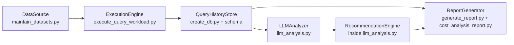

# Architecture Figure Draft

Use this as the basis for an IEEE-friendly vector figure.

Suggested IEEE caption:

> Fig. 1. Framework architecture for reproducible LLM-powered query monitoring. Public datasets are prepared by DataSource, executed by ExecutionEngine, stored in QueryHistoryStore, analyzed by LLMAnalyzer, rewritten by RecommendationEngine, and summarized by ReportGenerator.

Submission note:

- IEEE prefers figures that remain legible in two-column format.
- Convert this diagram to PDF, EPS, or PNG before final submission if possible.
- Avoid relying on Mermaid rendering inside the final LaTeX paper.
