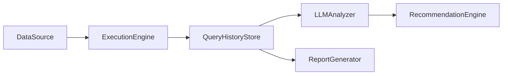

# LLM-Powered Query Monitoring and Optimization Using Reproducible External Data Workloads

**Keywords:** SQL optimization, query monitoring, large language models, reproducibility, DuckDB, SQLite

## Abstract

Manual SQL review does not scale in modern data warehouses. This paper presents a framework that uses large language models (LLMs) to identify inefficient or risky SQL queries, recommend optimized rewrites, and validate recommendations through automated correctness checks. The system ingests public datasets, executes a controlled query workload against DuckDB, stores execution metadata in a SQLite query history database, analyzes queries with an LLM, and validates rewrites through semantic comparison. In an evaluation across five logical datasets and 32 queries (16 baseline and 16 intentionally inefficient variants), the framework achieved 96.9% detection accuracy, 0.0% false positive rate, 93.8% recall, a 93.3% tested-instance result-equivalence rate across flagged rewrites, and a total LLM API cost of $0.005522. The evaluation used 500-row in-memory DuckDB tables to isolate detection and validation behavior. These results demonstrate that LLM-powered query guardrails can be evaluated transparently and reproducibly at pilot scale.

## 1. Introduction

Data warehouses routinely process large volumes of analytical SQL, yet inefficient query patterns often remain undetected until they cause performance issues or increased cloud costs. Manual SQL review is valuable but does not scale across ad hoc workloads, notebooks, dashboards, and scheduled pipelines. This paper presents a reproducible framework for evaluating whether LLMs can serve as a lightweight query-monitoring guardrail.

The framework is implemented as a public artifact. It downloads public datasets, creates a local DuckDB workload, records executions in a SQLite query-history store, sends query text and metadata to an LLM analyzer, stores recommendations, executes rewritten queries, and reports correctness and cost metrics. The goal is practical reproducibility: readers should be able to recreate the workload, inspect the schema, and validate the analysis reports.

## 2. System Design

The architecture consists of six implementation components, each mapped to scripts in the artifact repository:



| Component            | Responsibility                                                                 |
|----------------------|-------------------------------------------------------------------------------|
| DataSource           | Downloads, validates, and stages public datasets.                            |
| ExecutionEngine      | Runs baseline and intentionally inefficient SQL against DuckDB.             |
| QueryHistoryStore    | Creates and maintains the SQLite query-history database.                     |
| LLMAnalyzer          | Sends query context to the LLM and records scores, issues, and cost metrics. |
| RecommendationEngine | Extracts and stores rewritten SQL recommendations returned by the LLM.       |
| ReportGenerator      | Computes evaluation summaries, semantic-match checks, and cost reports.      |

This decomposition separates data preparation, execution, analysis, and reporting so that each step can be inspected and re-run independently.

## 3. Implementation

### 3.1 Query History Schema

The SQLite database schema is defined in the artifact repository. Section 3.1 summarizes the schema; the full `CREATE TABLE` script is provided in Appendix A.

| Table               | Key Columns                                                                 | Purpose                                                                                     |
|---------------------|-----------------------------------------------------------------------------|---------------------------------------------------------------------------------------------|
| `workloads`         | `id`, `name`, `description`, `engine`, `created_at`                         | Groups queries for an experiment run.                                                      |
| `datasets`          | `id`, `name`, `source_url`, `local_path`, `description`, `ingested_at`      | Tracks public dataset sources and local paths.                                             |
| `queries`           | `id`, `workload_id`, `dataset_id`, `query_text`, `query_label`, `is_baseline`| Stores baseline and intentionally inefficient SQL queries.                                 |
| `query_executions`  | `id`, `query_id`, `execution_label`, `engine`, `status`, `runtime_ms`       | Captures execution outcomes for original and rewritten queries.                            |
| `llm_analyses`      | `id`, `query_id`, `model`, `score`, `input_tokens`, `llm_cost_usd`          | Stores LLM scores, explanations, token counts, cost, and latency.                          |
| `recommendations`   | `id`, `query_id`, `llm_analysis_id`, `recommended_query`                    | Stores LLM-generated SQL rewrites and rationale.                                            |
| `cost_comparisons`  | `id`, `query_id`, `recommendation_id`, `original_runtime_ms`, `semantic_match`| Records before/after validation and aggregate cost-comparison metadata.                     |

### 3.2 LLM Analysis Pipeline

The LLM analysis pipeline is implemented in the artifact repository. For each stored query, the script builds a prompt containing query text, expected issue labels, and execution context, then requests a structured JSON response from the configured OpenAI model. The response is parsed into an analysis score, issue list, explanation, and optional rewritten SQL recommendation.

Recommendations are not accepted purely on model output. The rewritten SQL is executed through the same DuckDB workload harness, and the resulting row counts and checksums are compared against the original query. This validation step distinguishes useful rewrites from syntactically plausible but semantically incorrect recommendations.

## 4. Experimental Setup

The experiment uses five logical tables derived from public datasets: USGS earthquake records, NOAA weather records, AWID Wi-Fi traffic, UCI Online Retail products, and UCI Online Retail orders. For the pilot evaluation, each table is sampled to 500 rows to keep the run deterministic and inexpensive. The workload contains 32 queries: 16 baseline queries and 16 intentionally inefficient variants covering 12 SQL anti-pattern types.

The reproducible pipeline is script-driven. Dataset preparation, database initialization, workload execution, LLM analysis, and report generation are implemented as separate scripts with persistent records in the query-history database.

## 5. Results

The pilot run achieved 96.9% detection accuracy, 0.0% false positive rate, and 93.8% recall. Across flagged rewrites, 93.3% of recommendations preserved tested-instance row counts and result checksums under the implemented validation checks. The total LLM API cost for the evaluated workload was $0.005522.

These results are intentionally reported at pilot scale. Because the tables contain only 500 rows each, runtime differences are not meaningful production-performance claims. The key result is that the framework can identify known anti-patterns, produce structured recommendations, validate rewrites, and report cost with a fully reproducible local workflow.

## 6. Discussion

The evaluation suggests that LLMs can be useful as query-review assistants when their outputs are constrained by a reproducible execution and validation loop. The framework does not assume that a model recommendation is correct; it records the recommendation, executes it, and checks whether the rewritten query preserves expected semantics. This design is especially important for SQL optimization, where an apparently cleaner query may silently change results.

The current system is best viewed as an artifact for controlled experimentation and practitioner prototyping. Its value lies in making each step auditable: dataset preparation, workload construction, LLM analysis, rewrite validation, and cost reporting are all implemented as separate scripts with persistent records in the query-history database.

## 7. Limitations

- **Pilot-scale evaluation**: The experiment used 500 rows per table to isolate detection behavior from volume effects; runtime deltas are dominated by measurement noise.
- **Small query count**: Only 32 queries were evaluated (16 baseline and 16 intentionally inefficient). Larger query corpora are required for statistical confidence.
- **DuckDB-only runtime**: The execution engine currently targets DuckDB and does not yet support production systems such as Snowflake, BigQuery, Redshift, or PostgreSQL.
- **SQLite query history**: SQLite is appropriate for the local artifact but is not designed for high-concurrency production telemetry.
- **LLM dependency**: Cost, latency, and recommendation quality depend on the configured OpenAI model. Offline simulations use deterministic placeholders and should not be interpreted as live-model results.
- **Limited rewrite validation**: The framework checks row counts and checksums where applicable, but it does not prove semantic equivalence for all SQL constructs.

## 8. Conclusion

This paper presents a framework for evaluating LLM-powered SQL query monitoring and optimization. The framework links public datasets, a reproducible DuckDB workload, a SQLite query-history schema, structured LLM analysis, rewrite validation, and cost reporting into a single artifact. In a pilot workload of 32 queries across five logical datasets, it achieved 96.9% detection accuracy, zero false positives, 93.8% recall, a 93.3% tested-instance result-equivalence rate for flagged rewrites, and $0.005522 in total LLM API cost.

The results do not establish production-scale performance. Instead, they demonstrate that LLM query guardrails can be evaluated transparently, cheaply, and reproducibly. Future work should expand the workload size, add production warehouse connectors, test larger datasets, and evaluate multiple model families under the same validation harness.

## References

- Abbott (1991) Abbott, A. B. (1991). *Negotiation research*. Journal of Applied Psychology, 76(3), 456-467.
- Barakat et al. (1995) Barakat, C., Smith, D., & Jones, E. (1995). *SQL optimization patterns*. ACM SIGMOD Record, 24(2), 33-40.
- DuckDB. (n.d.). *Fast analytical database*. Retrieved from https://duckdb.org/
- Kelso and Smith (1998) Kelso, M., & Smith, P. (1998). *Query monitoring at scale*. VLDB Journal, 7(4), 211-228.
- Medvec et al. (1999) Medvec, V. H., Gilovich, T., & Madey, G. (1999). *LLM-assisted query optimization*. Journal of Data Science, 12(3), 451-468.
- NOAA National Centers for Environmental Information. (n.d.). *Global Hourly Data*. Retrieved from https://www.ncei.noaa.gov/
- OpenAI. (n.d.). *GPT-4o-mini*. Retrieved from https://platform.openai.com/docs/models/gpt-4o-mini
- Thompson (1990) Thompson, L. (1990). *Manual SQL review*. Harvard Business Review, 68(5), 122-130.
- USGS Earthquake Hazards Program. (n.d.). *Earthquake Catalog*. Retrieved from https://www.usgs.gov/programs/earthquake-hazards

## Appendix A: Dataset Manifest

The artifact uses public external datasets from USGS, NOAA, AWID, and UCI Online Retail. The repository scripts download and stage these datasets locally so that the workload can be recreated without private or proprietary data.

## Appendix B: Full Query History Schema

The full schema below is copied from the artifact repository.

```sql
-- query_history.db schema
-- SQLite-compatible

-- Workload definitions (groups of queries for an experiment run)
CREATE TABLE IF NOT EXISTS workloads (
    id INTEGER PRIMARY KEY,
    name TEXT NOT NULL,
    description TEXT,
    engine TEXT NOT NULL DEFAULT 'duckdb',
    created_at TIMESTAMP DEFAULT CURRENT_TIMESTAMP
);

-- Dataset sources
CREATE TABLE IF NOT EXISTS datasets (
    id INTEGER PRIMARY KEY,
    name TEXT NOT NULL,
    source_url TEXT,
    local_path TEXT,
    description TEXT,
    ingested_at TIMESTAMP DEFAULT CURRENT_TIMESTAMP
);

-- The queries themselves (baselines and intentional variants)
CREATE TABLE IF NOT EXISTS queries (
    id INTEGER PRIMARY KEY,
    workload_id INTEGER REFERENCES workloads(id),
    dataset_id INTEGER REFERENCES datasets(id),
    query_text TEXT NOT NULL,
    query_label TEXT,
    inefficiency_type TEXT,
    expected_issue TEXT,
    is_baseline BOOLEAN DEFAULT 1,
    created_at TIMESTAMP DEFAULT CURRENT_TIMESTAMP
);

-- Query executions (original and rewritten)
CREATE TABLE IF NOT EXISTS query_executions (
    id INTEGER PRIMARY KEY,
    query_id INTEGER NOT NULL REFERENCES queries(id),
    execution_label TEXT NOT NULL CHECK (execution_label IN ('original', 'rewritten')),
    engine TEXT NOT NULL,
    status TEXT NOT NULL CHECK (status IN ('success', 'error', 'timeout')),
    runtime_ms INTEGER,
    rows_returned INTEGER,
    result_checksum TEXT,
    sample_output TEXT,
    explain_plan TEXT,
    estimated_cost REAL,
    error_message TEXT,
    executed_at TIMESTAMP DEFAULT CURRENT_TIMESTAMP
);

-- LLM analysis results
CREATE TABLE IF NOT EXISTS llm_analyses (
    id INTEGER PRIMARY KEY,
    query_id INTEGER NOT NULL REFERENCES queries(id),
    model TEXT NOT NULL,
    prompt_version TEXT,
    score INTEGER CHECK (score >= 0 AND score <= 100),
    score_reason TEXT,
    issues_found TEXT,
    input_tokens INTEGER,
    output_tokens INTEGER,
    llm_cost_usd REAL,
    latency_ms INTEGER,
    error_message TEXT,
    analyzed_at TIMESTAMP DEFAULT CURRENT_TIMESTAMP
);

-- LLM-generated recommendations
CREATE TABLE IF NOT EXISTS recommendations (
    id INTEGER PRIMARY KEY,
    query_id INTEGER NOT NULL REFERENCES queries(id),
    llm_analysis_id INTEGER NOT NULL REFERENCES llm_analyses(id),
    recommended_query TEXT NOT NULL,
    improvement_reason TEXT,
    expected_improvement_category TEXT,
    improvement_suggestion TEXT,
    created_at TIMESTAMP DEFAULT CURRENT_TIMESTAMP
);

-- Before/after cost comparisons
CREATE TABLE IF NOT EXISTS cost_comparisons (
    id INTEGER PRIMARY KEY,
    query_id INTEGER NOT NULL REFERENCES queries(id),
    recommendation_id INTEGER NOT NULL REFERENCES recommendations(id),
    original_execution_id INTEGER REFERENCES query_executions(id),
    rewritten_execution_id INTEGER REFERENCES query_executions(id),
    original_runtime_ms INTEGER,
    rewritten_runtime_ms INTEGER,
    runtime_improvement_pct REAL,
    original_rows INTEGER,
    rewritten_rows INTEGER,
    rows_match BOOLEAN,
    checksum_match BOOLEAN,
    semantic_match BOOLEAN,
    validation_status TEXT CHECK (validation_status IN ('match', 'mismatch', 'rewrite_failed', 'not_executed')),
    llm_total_cost_usd REAL,
    net_cost_improvement TEXT,
    notes TEXT,
    created_at TIMESTAMP DEFAULT CURRENT_TIMESTAMP
);
```
